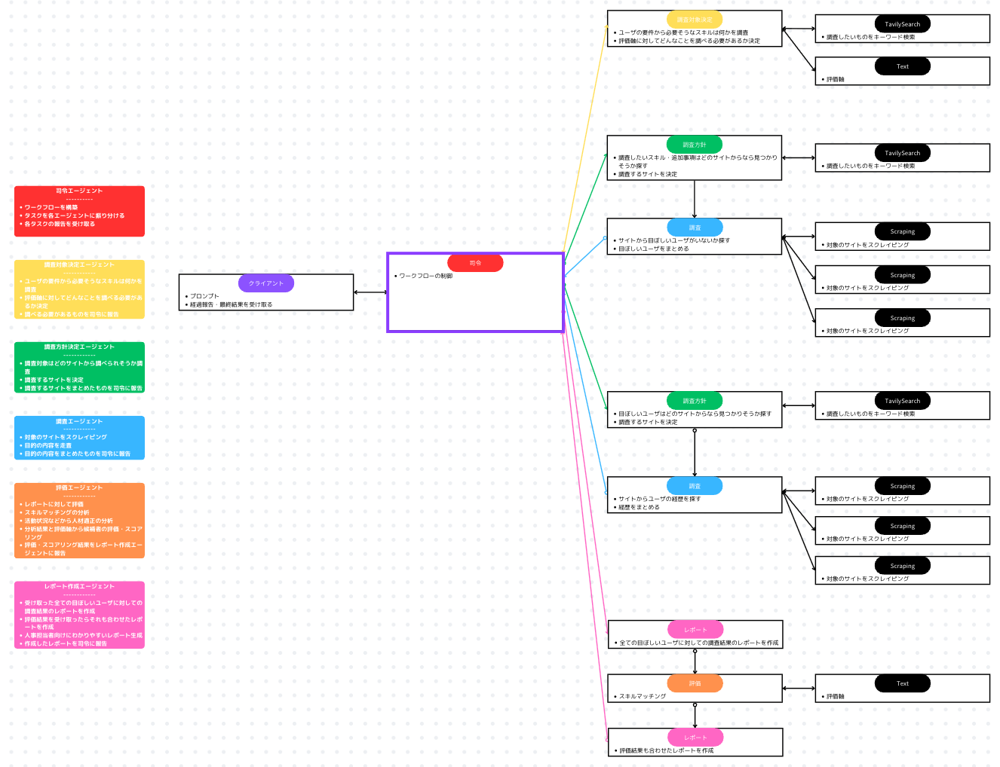
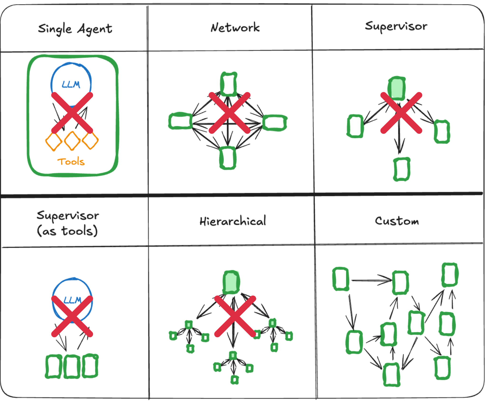

# AIエージェント

## ワークフロー図

## エージェント一覧

- **司令エージェント**  
  - ワークフローを構築
  - タスクを各エージェントに振り分ける
  - 各タスクの報告を受け取る
- **調査対象決定エージェント**  
  - ユーザの要件から必要そうなスキルは何かを調査
  - 評価軸に対してどんなことを調べる必要があるか決定
  - 調べる必要があるものを司令に報告
- **サイト決定エージェント**  
  - 調査対象はどのサイトから調べられそうか調査
  - 調査するサイトを決定
  - 調査するサイトをまとめたものを司令に報告
- **調査エージェント**  
  - 対象のサイトをスクレイピング
  - 目的の内容を走査
  - 目的の内容をまとめたものを司令に報告
<!-- - 相関関係エージェント
  - 人材同士の相関関係を分析
  - Neo4j AuraDBへのデータ反映 -->
- **評価エージェント**  
  - レポートに対して評価
  - スキルマッチングの分析
  - 活動状況などから人材適正の分析
  - 分析結果と評価軸から候補者の評価・スコアリング
  - 評価・スコアリング結果をレポート作成エージェントに報告
- **レポート作成エージェント**  
  - 受け取った全ての目ぼしいユーザに対しての調査結果のレポートを作成
  - 評価結果を受け取ったらそれも合わせたレポートを作成
  - 人事担当者向けにわかりやすいレポート生成
  - 作成したレポートを司令に報告

## ツール一覧

- **Web検索**  
  Tavily
- **Webスクレイピング**  
  BeautifalSoup4
<!-- - Neo4j AuraDBへのデータ格納 -->

## モデル

- Nova ( Amazon Bedrock )
- GPT ( OpenAI API )
- Gemini ( Google AI Studio )

## セッションメモリ
LangMemoを想定

<!-- ## 永続メモリ  
DynamoDBを想定 -->

## フレームワーク
- LangChain
  - LangGraph

## マルチエージェント形式の選定理由
### 最も今回の実現にふさわしいから
以下はLangChain(LangGraph)で実現できるエージェント形式である

- Single  
  実現不可能
- Network  
  複雑になりすぎる  
  全てがつながる必要性はない
- Supervisor  
  司令がいるので複数のエージェント管理がしやすそう  
  細かな指示ができないかもしれない  
  試してみたが、パイプライン制御はSupervisor次第(**プロンプト文のみでの制御次第**)であり、**複雑なワークフロー構築には限界がありそう**  
  全てを司令に送るのはトークン問題が心配
- **Hierarchical**  
  Supervisorの弱点の細かな指示も解決できそう  
  複雑なワークフロー構築には相変わらず限界がありそう
- **Custom**  
  今回目的が決まっているので、部分的なワークフローを組んでも良いかもしれない  
  全てを司令に送る必要もなくなるのでトークン問題も少し安心  
  実装が複雑になってしまう恐れ

以上の点から、今回は **Custom** を採用し、自由なワークフローを構築する。
