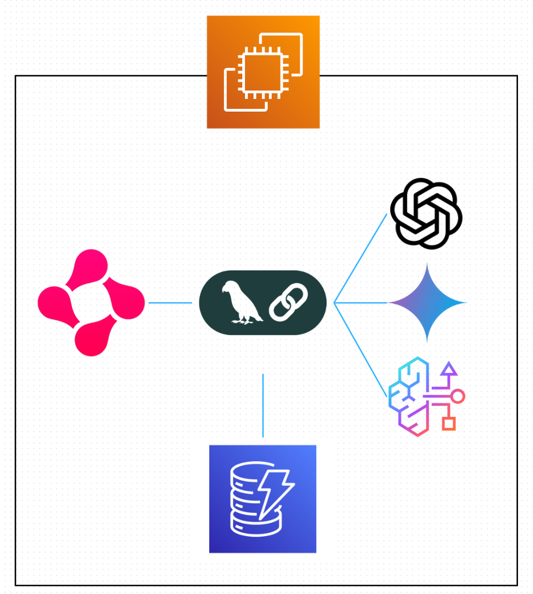

# 構成

## 選定技術

### AI Agent
今回の目的は、人事担当者がまだ見つけていない人材の発見である。  
人事担当者が既に確立した調査方法で調べても (既に確立された調査方法を自動化しても)、同じような結果しか得られないと考えられる。  
そこで今回は、AI Agentの自立して推論・実行を行う特徴を活かし、時にはまだ確立されていない方法でAIに人材の調査をしてもらうことで、従来の調査方法では見つからなかった人材の発見を試みる。

### Multi-Agent-System
複数のAIエージェントが相互に通信・協調してタスクを遂行させる。  
今回は、より多くの未発見の人材を見つけたいため、複数のアプローチから人材の調査を試みたいが、こうした全てのアプローチを1つのAIエージェントに任せるよりは、各エージェントに役割を分担させることで、各アプローチによる調査結果の精度を高く維持させることを期待する。  

### LangChain
マルチエージェントシステム構築のための柔軟かつ強力なフレームワークであり、AWS環境でのデプロイに高い親和性がある。  
また、AIエージェントの制御、外部ツールやAPIとの連携を容易に実現できるため採用する。

### スクレイピング
まずはBeautifulSoupだけでデモ版作れるかも  
tavilyもよいかも  
scrapyが気になる  
調査の必要あり

### Python
人材調査の際に必要であるであろうWebスクレイピングのための豊富なライブラリを備えており、またGoogle ADKではPythonを用いるため、今回はPythonを採用する。

### Nova ( Amazon Bedrock )
AWS環境との相性が良く、今回BedrockのNovaモデルを無償で使わせてもらえるため使用する。

### GPT ( OpenAI API )
たまたま購入済みの分のクレジットがあるので使用しようと思う。

### Gemini ( Google AI Studio )
無料で提供されているGeminiモデルを用いようと思う。

<!-- ### Neo4j AuraDB <= 仮
可能であれば人材ネットワークの可視化も実現したい。  
Neo4j AuraDBはグラフ構造を持つデータベースであり、人材ネットワークのグラフを直接表現できることを期待する。 -->

## 環境

### デプロイ
AWSのEC2を採用。

### CI / CD
GitHub Actions採用。 ( 本リポジトリをGitHub上で管理しており、相性が良いから。 )

### 開発
uvでライブラリのバージョン管理。( 堅実なバージョン管理と高速な依存関係解決が可能だから。 )
ruffでLintチェック。( uvと相性が良いから。 )
tyで型チェック。( uvと相性が良いから。 )
